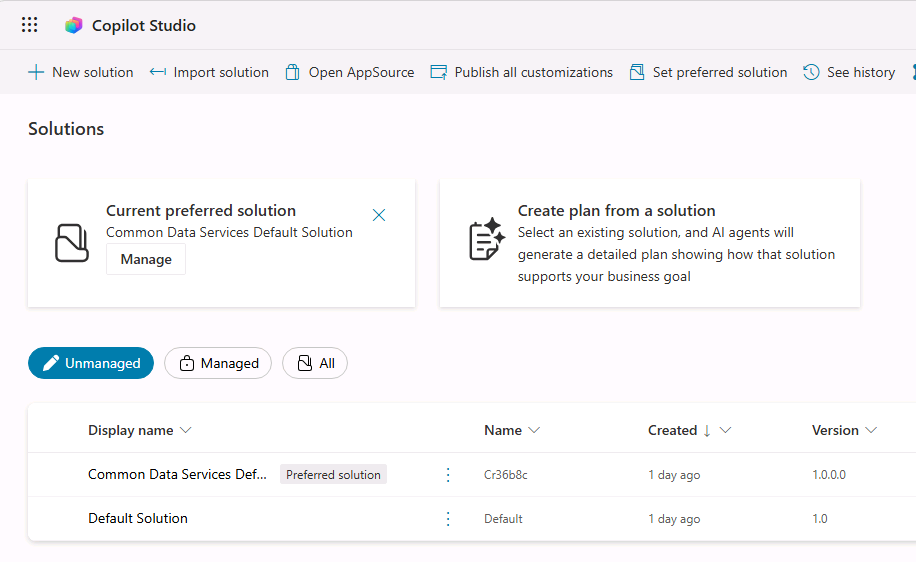
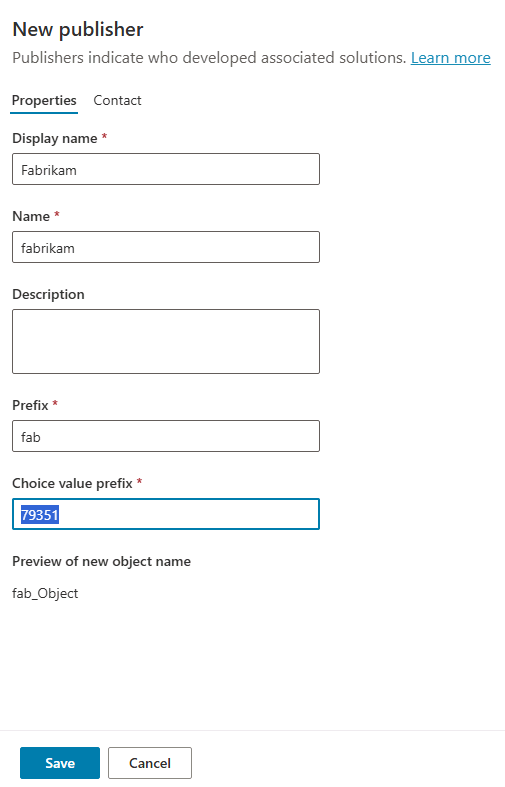

---
lab:
  title: ILT Setup
  module: Introduction
  description: In this exercise, you will access the Microsoft Copilot Studio portal and create an environment and solution to use throughout the remaining labs.
  duration: 10 minutes
  level: 200
  islab: true
  primarytopics:
    - Microsoft Copilot
    - Microsoft Copilot Studio
---

## Exercise 1 - Access Copilot studio


1. In a new browser tab, navigate to `https://copilotstudio.microsoft.com/` and sign in if prompted.

  > [!NOTE]  
  > If you experience issues loading Copilot Studio or your environment:
  > - First, capture your environment ID (GUID) from the Power Platform admin center:
  >   1. Open the environment you created at `https://admin.powerplatform.microsoft.com/manage/environments`.
  >   2. Locate the environment ID in the URL (a long string such as `12345678-90ab-cdef-1234-567890abcdef`).
  >   3. Copy and save this value.
  > - Then try accessing your environment directly by pasting your ID into the following URL:
  >   ```
  >   https://copilotstudio.microsoft.com/environments/<your-environment-id>/home
  >   ```

1. If prompted, select **Get Started** and keep the default country or region settings.

1. Skip any welcome messages.

1. In the upper right corner of the page, switch environments by using the Environment Selector and select the environment you created.

   

### Task 1.1 - Create a solution

1. In the left navigation pane, select the ellipses (**...**), and select **Solutions**.

1. You should see several solutions including the *Default Solution* and the *Common Data Services Default Solution*.

   

1. Select **+ New solution**.

1. In the **Display name** text box, enter **`Lab Exercises`**

1. Verify that **Name** is automatically populated.

1. Select **+ New publisher** below the **Publisher** drop-down.

1. For **Display name**, enter `Fabrikam`

1. For **Name**, enter `fabrikam`

1. For **Prefix**, enter `fab`

   

1. Select **Save**.

1. Verify that **Fabrikam (fabrikam)** is selected in the **Publisher** drop-down.

1. Select the **Set as your preferred solution** checkbox.

   > [!NOTE]
   > Setting this as your preferred solution ensures new assets created during later labs are added to the Lab Exercises solution by default.

   

1. Select **Create**.

1. Close the **Solutions** browser tab.

1. Refresh the **Copilot Studio** page.

You now have a Power Platform environment and solution to work in.
